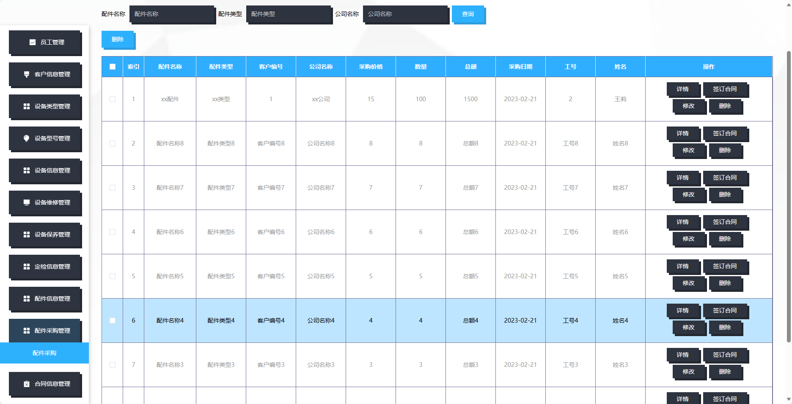

基于SpringBoot的档案管理系统（程序+论文）
=
- 完整代码获取地址：从戎源码网 ([https://armycodes.com/](https://armycodes.com/))
- 作者微信：19941326836  QQ：952045282 
- 承接计算机毕业设计、Java毕业设计、Python毕业设计、深度学习、机器学习
- 选题+开题报告+任务书+程序定制+安装调试+论文+答辩ppt 一条龙服务
- 所有选题地址https://github.com/nature924/allProject

一、项目介绍
---
基于Spring Boot框架实现的档案管理系统，系统包含两种角色：管理员、用户,系统分为前台和后台两大模块，主要功能如下。

### 前台功能：
- 首页：展示系统的概况、最新资讯等内容。
- 个人中心：用户可以管理个人信息、修改密码等。
- 客户信息管理：包括客户信息的新增、编辑、删除和查询功能。
- 设备信息管理：包括设备信息的新增、编辑、删除和查询功能。
- 设备维修管理：包括设备维修记录的新增、编辑、删除和查询功能。
- 设备保养管理：包括设备保养记录的新增、编辑、删除和查询功能。
- 定检信息管理：包括定期检查信息的新增、编辑、删除和查询功能。
- 配件信息管理：包括配件信息的新增、编辑、删除和查询功能。
- 配件采购管理：包括配件采购记录的新增、编辑、删除和查询功能。

### 后台功能：
### 管理员：
- 个人中心：管理个人信息和账户。
- 员工管理：管理员工账号，包括新增、编辑、删除员工账号。
- 客户信息管理：管理客户信息，包括新增、编辑、删除客户信息。
- 设备类型管理：管理设备类型，包括新增、编辑、删除设备类型。
- 设备型号管理：管理设备型号，包括新增、编辑、删除设备型号。
- 设备信息管理：管理设备信息，包括新增、编辑、删除设备信息。
- 设备维修管理：管理设备维修记录，包括新增、编辑、删除设备维修记录。
- 设备保养管理：管理设备保养记录，包括新增、编辑、删除设备保养记录。
- 定检信息管理：管理定期检查信息，包括新增、编辑、删除定期检查信息。
- 配件信息管理：管理配件信息，包括新增、编辑、删除配件信息。
- 配件采购管理：管理配件采购记录，包括新增、编辑、删除配件采购记录。
- 合同信息管理：管理合同信息，包括新增、编辑、删除合同信息。

### 员工：
- 个人中心：管理个人信息和账户。
- 客户信息管理：包括客户信息的新增、编辑、删除和查询功能。
- 设备信息管理：包括设备信息的新增、编辑、删除和查询功能。
- 设备维修管理：包括设备维修记录的新增、编辑、删除和查询功能。
- 设备保养管理：包括设备保养记录的新增、编辑、删除和查询功能。
- 定检信息管理：包括定期检查信息的新增、编辑、删除和查询功能。
- 配件信息管理：包括配件信息的新增、编辑、删除和查询功能。
- 配件采购管理：包括配件采购记录的新增、编辑、删除和查询功能。

二、项目技术
---
- 编程语言：Java
- 数据库：MySQL
- 项目管理工具：Maven
- 前端技术：VUE、HTML、Jquery、Bootstrap
- 后端技术：Spring、SpringMVC、MyBatis

三、运行环境
---
- 操作系统：Windows、macOS都可以
- JDK版本：JDK1.8以上都可以
- 开发工具：IDEA、Ecplise、Myecplise都可以
- 数据库: MySQL5.7以上都可以
- Tomcat：任意版本都可以
- Maven：任意版本都可以

四、运行截图
---
### 论文截图：

### 程序截图：

